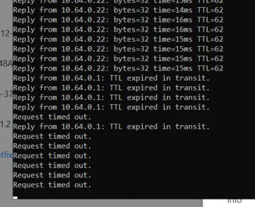

Switch erişimini kaybettiğimiz anda ping de atıyorduk. Böyle ping cıktısı bu şekildeydi.  Bu switch kabinet1-2 10.64.0.22

Sorunu bulmam yardım et benzer seyler baska kenar swıtclerde de oluyor. 
Eger gerekırse sana ssh ile erişim sağlayabilmen için bilgileri paylaşabilirim..

Swıtch web yönetim consolu loglarında böyle bir hata gördük.

info *2026 Aug 11 16:44:44 Kabinet1-2 %NETD-6: Interface vlan1 learns router ip address 10.64.0.1 by DHCP. info *2026 Aug 11 16:44:44 Kabinet1-2 %NETD-6: Interface vlan1 gets ip address 10.64.0.22/24 by DHCP. info *2026 Aug 11 16:44:34 Kabinet1-2 %NETD-6: Interface vlan1 changed state to up info *2026 Aug 11 16:44:33 Kabinet1-2 %HAL-6: Interface tengigabitEthernet0/49 changed state to up info *2026 Aug 11 16:39:32 Kabinet1-2 %NETD-6: Interface vlan1 changed state to down info *2026 Aug 11 16:39:31 Kabinet1-2 %NETD-6: Interface vlan1 changed state to up info *2026 Aug 11 16:39:30 Kabinet1-2 %NETD-6: Interface vlan1 changed state to down info *2026 Aug 11 16:39:29 Kabinet1-2 %NETD-6: Interface vlan1 changed state to up info *2026 Aug 11 16:39:28 Kabinet1-2 %NETD-6: Interface vlan1 changed state to down info *2026 Aug 11 16:39:27 Kabinet1-2 %NETD-6: Interface vlan1 changed state to up info *2026 Aug 11 16:39:25 Kabinet1-2 %NETD-6: Interface vlan1 changed state to down info *2026 Aug 11 16:39:24 Kabinet1-2 %NETD-6: Interface vlan1 changed state to up info *2026 Aug 11 16:39:23 Kabinet1-2 %NETD-6: Interface vlan1 changed state to down
