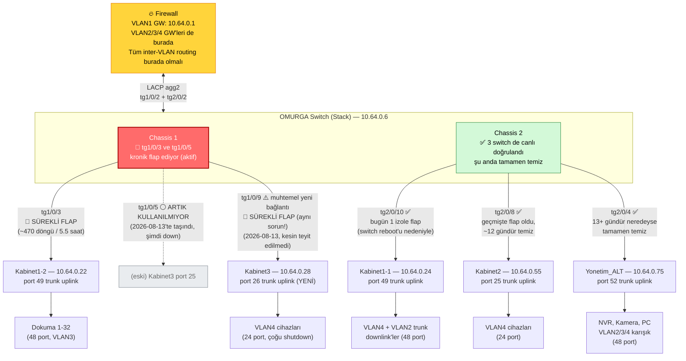
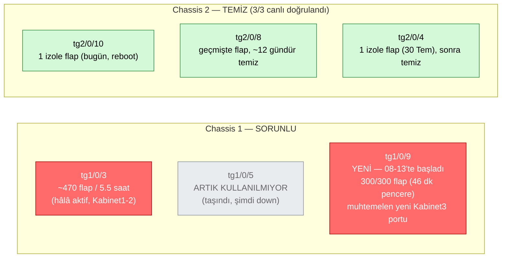

# Ozdoku Network Topoloji Diyagramı

Bu diyagram `usak_topoloji.md` ve `config/` altındaki cihaz konfigürasyonlarından, ayrıca `investigation.md`'deki canlı SSH bulgularından derlenmiştir. Sorunlu bağlantılar (CASE-007) kırmızı ile işaretlenmiştir.

**Son güncelleme:** 2026-08-13 — Kabinet3'ün fiziksel bağlantısı SFP değişimi sırasında taşındı (aşağıda işaretli). Bu diyagram `investigation.md` ile birlikte güncel tutulmalıdır; investigation dosyasında yeni case/bulgu eklendikçe burası da güncellenmeli.

⚠️ **2026-08-13 fiziksel değişiklik:** Müşteri, Omurga ve Kabinet3 taraflarında SFP değiştirdi. Kabinet3 tarafı artık **port 26** (port 25 değil) kullanıyor. Omurga tarafında bağlantının **tg1/0/9**'a taşınmış olması güçlü ihtimal (trafik deseniyle destekleniyor) ama fiziksel olarak %100 teyit edilmedi. **Sorun taşındı, çözülmedi** — tg1/0/9 şu anda tg1/0/3/tg1/0/5 ile aynı kronik flap'i gösteriyor. Detay: `investigation.md` CASE-007.

---

## Genel Topoloji

---

## VLAN Planı

| VLAN | Subnet | Ad | Not |
|---|---|---|---|
| VLAN1 | 10.64.0.0/24 | ManagementVlan | Switch yönetimi, gateway firewall (10.64.0.1) |
| VLAN2 | 10.64.2.0/24 | ClientsVlan | |
| VLAN3 | 10.64.3.0/24 | IOTVLAN | Dokuma makineleri (Kabinet1-2 üzerinden) |
| VLAN4 | 10.64.4.0/24 | KameraVlan | Kameralar, NVR |

Tüm VLAN'lar Omurga üzerinden L2 trunk ile firewall'a taşınıyor; DHCP gateway'leri firewall'da tanımlı. (CASE-002/003: bu varsayımla çelişen TTL bulgusu `investigation.md`'de ayrıca takip ediliyor.)

---

## Uplink Port Eşleme Tablosu

| Kenar Switch | IP | Uplink Portu | Omurga Portu | Chassis | Durum (2026-08-11) |
|---|---|---|---|---|---|
| Kabinet1-1 | 10.64.0.24 | 49 | tg2/0/10 | 2 | ✅ Temiz (canlı doğrulandı) — bugün ~18:43 açıklanmamış coldstart, 1 izole flap'e sebep oldu |
| Kabinet1-2 | 10.64.0.22 | 49 | tg1/0/3 | **1** | 🔴 Kronik flap — CASE-007, hâlâ aktif (2026-08-13'te tekrar kontrol edilmedi) |
| Kabinet2 | 10.64.0.55 | 25 | tg2/0/8 | 2 | ✅ Temiz (canlı doğrulandı) — geçmişte (~12 gün önce) 387 flap olayı, artık aktif değil |
| Kabinet3 | 10.64.0.28 | ~~25~~ **26 (2026-08-13'te taşındı)** | ~~tg1/0/5~~ **tg1/0/9 (kesin teyit edilmedi)** | **1** | 🔴 Sorun taşındı, çözülmedi — yeni port da kronik flap ediyor |
| Yonetim_ALT | 10.64.0.75 | 52 | tg2/0/4 | 2 | ✅ Temiz (canlı doğrulandı) — 30 Temmuz'da 1 izole flap, sonrasında temiz |
| Omurga (stack) | 10.64.0.6 | tg1/0/2 + tg2/0/2 (LACP) | Firewall | 1+2 | ✅ Normal |

---

## Sorun Örüntüsü (CASE-007 özeti)

**Önemli çıkarım (2026-08-13):** SFP/port değişimi sorunu çözmedi — chassis 1 içinde `tg1/0/5`'ten `tg1/0/9`'a taşıdı. Bu, kök nedenin belirli bir SFP/porta değil, **Omurga chassis 1'in kendisine** (veya değişimlerde ortak kullanılan bir fiber/patch kablosuna) işaret ettiğini güçlendiriyor.

**CASE-010 (güvenlik, ayrı konu):** Kabinet2↔Kabinet3 ve Kabinet1-1↔Yonetim_ALT ikişerli gruplar halinde birebir aynı SSH host key'i paylaşıyor — muhtemelen fabrika varsayılanı anahtar, MITM riski.

Detaylı bulgular, hipotezler ve doğrulama adımları için bkz. `investigation.md` — CASE-007, CASE-010, CASE-011.
